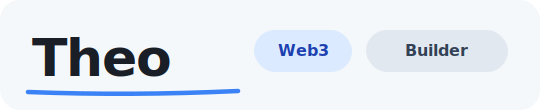
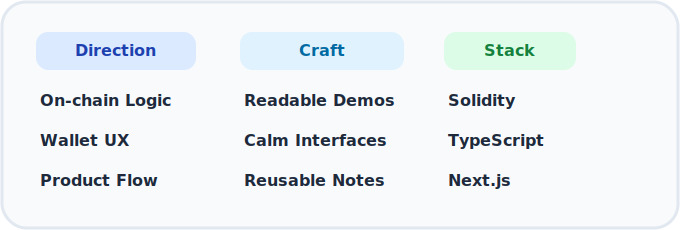
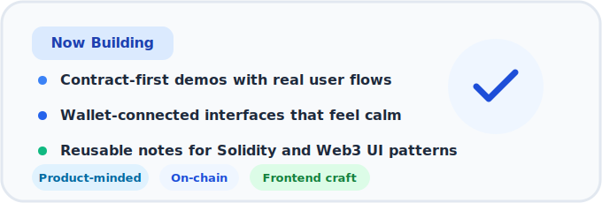

<!-- Profile README for theoweb3 -->

<h1 align="center">Hi, I'm Theo</h1>

  

---

  
   
  
  
  

 

I am a Web3 full-stack developer focused on translating smart contract ideas into clear product experiences. My work sits between Solidity, frontend engineering, and the interaction details that make an interface feel trustworthy.

- Working across `Solidity`, `TypeScript`, `React`, `Next.js`, `Ethers`, `Wagmi`, and `Hardhat`.
- Prototyping from contract behavior to interface flow, so demos are shaped around real use.
- Turning notes from practice into reusable patterns for future builds.

 
 

 

  
  
  
  

## Tech Stack

  

## GitHub Stats

<!-- GitHub Readme Stats service is temporarily paused. Using alternative: -->

---

  Last updated: 2026

